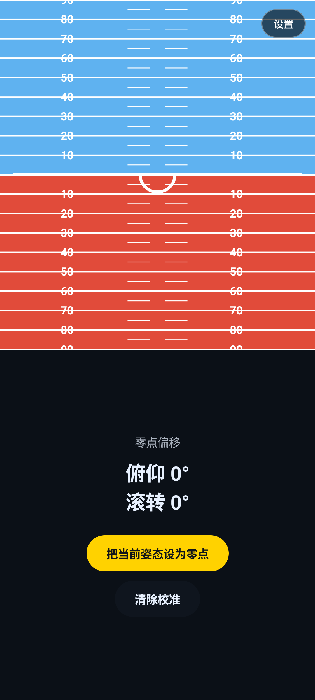
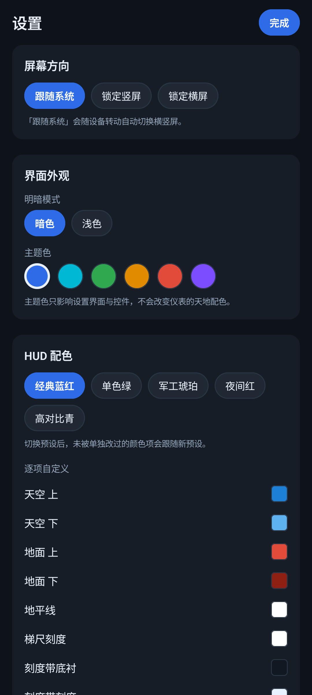

# Speed — 飞行姿态仪

仿飞机姿态仪（人工地平仪 / Attitude Indicator）的 Android 应用。
读取手机姿态传感器与 GPS，把屏幕**均分为两块可自由配置的面板**，实时显示飞行姿态与飞行数据。

| 竖屏（上：姿态仪 / 下：速度带） | 设置界面（暗色） |
| --- | --- |
|  |  |

横屏效果见 [docs/landscape.png](docs/landscape.png)（左：姿态仪 / 右：速度带）。
面板分配是自由的，上面只是默认配置。

## 核心设计：两块可配置面板

屏幕**均分二等分**（`weight(1f)`，严格各占一半）：

- **横屏** → 左半屏 / 右半屏
- **竖屏** → 上半屏 / 下半屏

每块面板可以从下面 6 种仪表里任选一种（横屏和竖屏的配置**各自独立保存**）：

| 仪表 | 说明 |
| --- | --- |
| 姿态仪 | 天地色块 + 俯仰梯尺 + 俯仰刻度带 + 弧形滚转刻度 |
| 速度带 | GPS 地速，左侧滚动刻度带 + 右侧大字读数 |
| 高度带 | 海拔 + 升降率；海拔源可选（默认气压计），升降率恒为气压 |
| 航向带 | 罗盘条横向滚动，N/NE/E/SE/S/SW/W/NW 八方位标注 |
| 数字读数 | 俯仰/滚转/航向/地速/海拔/升降率 一屏全列 |
| 空白 | 只显示深色底，用于刻意留白 |

## 设置菜单

点右上角「设置」进入，分五区：

### 屏幕方向
跟随系统 / 锁定竖屏 / 锁定横屏。锁定通过 `requestedOrientation` 实现，跟随系统用 `fullSensor`（四个方向都支持）。

### 仪表风格
双面板自由组合 / EFIS 综合显示。

### 高度数据源
**气压计**（默认）/ **GPS**。选择哪个就只用哪个，该来源无数据时显示 `--`，绝不自动切换。升降率始终由气压计计算，与高度源无关。

### 界面外观
- **明暗模式**：暗色 / 浅色，作用于设置界面与控件。
- **主题色**：蓝 / 青 / 绿 / 琥珀 / 红 / 紫，作用于设置界面与按钮。

> 主题色**不会**改变仪表的天地配色 —— 仪表区始终用高对比度的真实配色，这是有意为之：
> 天地色对比度不足会直接导致姿态读不出来。

### HUD 配色
5 套预设：经典蓝红 / 单色绿 / 军工琥珀 / 夜间红 / 高对比青。

在此之上还能**逐项自定义** 11 个颜色：天空上/下、地面上/下、地平线、梯尺刻度、刻度带底衬、刻度带刻度、指针、读数文字、中央基准。

覆写规则：换预设时只清掉被单独改过的项，其余继续跟随预设。设置里也提供「恢复此项为预设」和「恢复全部自定义」。

### 面板分配
分别为竖屏和横屏指定两块面板各显示什么。

## 航向仪：圆的投影（三维观察）

航向仪不是把刻度平铺在屏幕上，而是**真的做了透视投影** ——
模拟"站在圆心看一圈罗盘刻度"，只有视野（圆心角）覆盖到的那一段刻度可见。

### 投影推导

眼点在原点、屏幕平面 `z = 1`。刻度画在半径为 R 的圆上，
相对当前航向 φ 处的一点为 `(R·sinφ, -h, D + R·cosφ)`（D 为眼点到圆心的水平距离）：

```
xProj = R·sinφ / (D + R·cosφ)
yProj = -h    / (D + R·cosφ)
```

取 `R = 1`、`h = R`，即得代码里的两行：

```kotlin
val denom = eyeDistance + cos(phi)
val x = centerX + (sin(phi) / denom) * screenRx
val y = baselineY - (1.0 / denom) * screenRy
```

于是：

- φ = 0（正前方）时 `x = 0`、`y = -1/(D+1)` —— 曲线的**最低点**，离眼点最近
- φ = ±90° 时 `y = -1/D` —— 抬得更高，符合"越远越高"的透视直觉
- **水平方向被透视压缩**：近处刻度展开、远端挤在一起

刻度按**等角度**分布在圆上，屏幕上近处稀、远处密 —— 与看真实物体的观感一致。

### 自适应横竖屏

| | 眼点距离 D | 横纵半径比 | 说明 |
| --- | --- | --- | --- |
| 横屏（宽 > 高×1.3） | 0.62 | 0.95 | 圆画大、透视更明显 |
| 竖屏 | 0.85 | 0.60 | 纵向压扁，避免曲线顶到面板上沿 |

### 必须裁剪

`Canvas` 上挂了 `clipToBounds()`。地平线和天地色块都是超长绘制
（`reach` 远大于面板宽度），不裁剪的话整条地平线会**横穿到旁边的面板**上去
（实测：横屏时地平线溢出到右半屏）。

## 姿态仪：传统地平仪布局

姿态仪采用**传统机械地平仪**的表达方式：

- **天地色块整体倾斜**来反映手机倾斜程度 —— 倾斜角就是滚转角，这是最直观的表达
- **机体基准线完全固定不动**：一根贯穿全宽的白线 + 中间朝下的中空半圆（半圆上带滚转刻度）
- **俯仰梯尺**跟着天地色块一起倾斜升降

| 元素 | 行为 |
| --- | --- |
| 天地色块 | 绕面板中心旋转 `-roll`，随俯仰上下平移 |
| 地平线 | 与天地色块同一个变换，永远与色块分界重合 |
| 俯仰梯尺 | 同上（一起倾斜升降），每 10° 长刻度、每 5° 短刻度 |
| **机体基准线** | **写死在面板中心**，不随俯仰平移、也不随滚转旋转 |
| 半圆滚转刻度 | 每 10° 一条刻度线、每 30° 加长，画在中空半圆上 |

### 比例尺与刻度长度

`每度像素 = 面板高度 / 2 / 90` —— **180° 铺满整个面板高度**，保证 ±90° 全范围可见。

刻度线长度定义在 `AttitudeTile.kt` 顶部的三个常量里
（`LADDER_MINOR_LENGTH` / `LADDER_MAJOR_LENGTH` / `LADDER_GAP`），
**绘制层和数字层必须引用同一组常量** —— 早先两处各算一遍，
`rotate` 之后两套偏移被旋转放大，数字和刻度线整体错开。

### 天地色块的覆盖范围（踩过的坑）

色块画在 `rotate` 之后的坐标系里，并且还会被俯仰平移，所以覆盖半径必须同时算上两者：

```
reach = hypot(width, height) / 2 + 90 * pixelsPerDegree
```

只按半对角线算（不加俯仰余量）时，实测 `pitch=85°` 会露出 3208 个采样格的背景色。

## 姿态融合：互补滤波与零偏标定

陀螺仪与绝对姿态（旋转矢量 / 方向传感器）按下式融合：

```
predicted = previous + gyroRate * dt
fused     = predicted + (absolute - predicted) * (1 - ALPHA)      // ALPHA = 0.90
```

**最后一项是关键**：它构成负反馈，预测值跑偏时会被绝对姿态拉回来。

> ⚠️ 早先的实现写成 `fused = absolute + blend * gyroRate * dt`，
> 每帧都被绝对姿态重置、**完全没有反馈** —— 那不是互补滤波。
> 后果是陀螺零偏线性累积成漂移，敲一下桌子画面就飘走、校准也救不回来。

### 陀螺零偏

校准做**两件事**，缺一不可：

1. 记录当前俯仰/滚转作为**姿态零点**（消除安装倾角与固定偏置）
2. 采样 3 秒静止读数，写入**陀螺零偏**（消除积分漂移）

只做第 1 步的话零点虽然对了，但积分仍会持续漂移。此外还有一层慢速**残余零偏**估计
（只在"陀螺读数很小 **且** 预测值与绝对姿态基本吻合"时才更新，避免把真实转动当成零偏）。

零偏值不做持久化：每次开机静止几秒即可由上述机制收敛，无需用户重复校准。

## 姿态数据是怎么算的

传感器优先级自动降级：

| 优先级 | 传感器 | 说明 |
| --- | --- | --- |
| 1 | `TYPE_ROTATION_VECTOR` | 陀螺仪 + 加速度计 + 磁力计融合，绝对姿态，无漂移 |
| 2 | `TYPE_GAME_ROTATION_VECTOR` | 陀螺仪 + 加速度计融合，不受磁干扰 |
| 3 | `TYPE_ORIENTATION` | 老设备兼容回退 |

拿到绝对姿态后，再用 `TYPE_GYROSCOPE` 的角速率做**互补滤波**：陀螺仪响应快但会漂移，
旋转矢量不漂移但刷新率略低，两者按 50% 融合，兼顾跟手与稳定。

### 屏幕坐标系：横竖屏都以"手机水平方向"为基准

这是最容易做错的一环，分三层：

**第一层：屏幕方向必须实时读取，不能缓存。**
清单里声明了 `configChanges=orientation|...`，**旋转屏幕时 Activity 不会重建**，
任何在 `onCreate` 里赋一次的字段都会一直停在初始方向。所以用
`rotationProvider: () -> Int` 这个 lambda，每次采样现取 `display.rotation`。

**第二层：重力向量也要重映射到屏幕坐标系。**
`TYPE_ACCELEROMETER` 给的是**机身坐标系**的分量，而"屏幕向上"在横屏时对应机身的 ±X 轴。
不重映射的话横屏滚转是错的（地平线不跟着设备转）。

重映射**不要手写分量公式** —— `SensorManager.remapCoordinateSystem` 内部会做右手系修正
（两轴叉乘方向相反时取反），手写很难与它保持一致，实测在 `ROTATION_270` 下差一个负号
（滚转显示 ±180°）。正确做法见 `remapVectorToScreenFrame`：构造以该向量为 x 轴的正交矩阵，
走同一个 `remapCoordinateSystem`，再取回变换后的 x 轴。

**第三层：滚转角取自屏幕坐标系重力在屏幕平面上的投影。**
`TYPE_ACCELEROMETER` 测的是**支持力**而非重力（设备水平静止时读数为 `(0, 0, +9.81)`），
所以"屏幕上方"就是 **+g** 方向，滚转 = `atan2(gx, gy)`。
写成 `atan2(-gx, -gy)` 会得到反方向，竖直握持时显示 ±180°。

俯仰取屏幕**法线**（屏幕坐标系矩阵 R[8]）相对地平面的仰角并取负：
`pitch = −asin(R[8])`，屏幕朝上 = −90°、竖直 = 0°、屏幕朝下 = +90°。
用 `asin` 而不是 `atan` —— `asin` 的曲线是球面角距，任何滚转角下都保持线性。
滚转用重力在屏幕平面上的投影 `roll = atan2(−R[6], R[7])`（右倾为正）。
所有公式集中在 `AttitudeMath.kt`，有 28 个单元测试覆盖四种 display rotation、
0/360 环绕和 ±90° 边界。

### 行为验证（注入加速度实测）

| 场景 | 机体重力 | 屏幕坐标系重力 | 滚转 |
| --- | --- | --- | --- |
| 竖屏 | `(0, +9.8)` | `(0, +9.8)` | **0** |
| 横屏 (ROTATION_270) | `(-9.8, 0)` | `(0, +9.8)` | **0** |
| 横屏 + 倾斜 30° | `(-4.9, +8.5)` | — | 地平线线性倾斜 |

即：**把手机横过来时地平线保持水平**（垂直于地平线的方向恰好与屏幕向上一致），
只有真正倾斜设备时地平线才跟着转。


## 飞行数据（GPS + 气压计）

- **地速**：`Location.getSpeed()`，单位 m/s，界面换算成 km/h。
- **海拔**：**数据源由用户选择**（设置 → 高度数据源，默认「气压计」）：
  - 气压计：`TYPE_PRESSURE` + 国际标准大气公式（米级精度）
  - GPS：`Location.hasAltitude()/altitude`
  选择哪个就只用哪个；该来源无数据时显示 `--`，**不会自动切换**。
- **升降率**：与高度来源**独立**，始终由气压高度微分得到，并对高度和升降率
  各做一次低通滤波 —— 否则气压噪声会被微分放大成剧烈跳动。无气压计时显示 `--`。

定位用系统 `LocationManager` 而不是 FusedLocationProvider，少一个外部依赖。

**没有定位权限时**速度显示占位符、GPS 源的高度显示 `--`；姿态仪完全不受影响
（它只用惯性传感器）。

## 横竖屏的处理

`MainActivity` 用 `display.rotation` 把机身坐标系的向量换算到**当前屏幕坐标系**，
所以"屏幕上方"始终正确。否则设备滚转 90° 后 Android 会把屏幕转成横屏，
半圆滚转刻度会被画到设备侧边去。

`android:configChanges` 已声明方向变化，旋转时不重建 Activity，仪表不会闪断。

## 设置持久化

用 `SharedPreferences` 而不是 DataStore —— 省一个依赖，这个量级完全够用。
配色覆写只存被改动过的项（键为 `HudColorKey.name`），这样切换预设时
未改动的项能自动跟随新预设。

## 工具链

| 组件 | 版本 | 位置 |
| --- | --- | --- |
| JDK | Oracle JDK 21.0.9 | `C:\Program Files\Java\jdk-21` |
| Android SDK | — | `F:\Android\Sdk` |
| SDK Platform | Android 37.0 (API 37) | `F:\Android\Sdk\platforms\android-37.0` |
| Build-Tools | 36.1.0 | `F:\Android\Sdk\build-tools\36.1.0` |
| Platform-Tools (adb) | 37.0.1 | `F:\Android\Sdk\platform-tools` |
| Emulator | 37.2.12 | `F:\Android\Sdk\emulator` |
| AVD | `Speed_API36`（Pixel 7，API 36） | `F:\Android\avd` |
| Gradle | 9.8.0 | wrapper 自动管理 |
| AGP | 9.4.1 | `gradle/libs.versions.toml` |
| Kotlin | 2.4.20 | `gradle/libs.versions.toml` |
| Compose BOM | 2026.09.00 | `gradle/libs.versions.toml` |

未安装 Android Studio，全部通过 Gradle 命令行开发。

## 环境变量（用户级，无需管理员权限）

```
JAVA_HOME        = C:\Program Files\Java\jdk-21
ANDROID_HOME     = F:\Android\Sdk
ANDROID_SDK_ROOT = F:\Android\Sdk
PATH            += F:\Android\Sdk\platform-tools
PATH            += F:\Android\Sdk\emulator
PATH            += F:\Android\Sdk\cmdline-tools\latest\bin
```

> **已经打开的终端 / 编辑器需要重启**才能读到这些值。

## 常用命令

```powershell
.\gradlew.bat assembleDebug     # debug 包 → app\build\outputs\apk\debug\app-debug.apk
.\gradlew.bat assembleRelease   # release 包（已签名）→ app\build\outputs\apk\release\app-release.apk
.\gradlew.bat installDebug      # 构建并安装到已连接设备
.\gradlew.bat lint              # 静态检查
.\gradlew.bat test              # 单元测试
.\gradlew.bat clean             # 清理
```


## 版本记录

| 版本 | 主要改动 |
| --- | --- |
| 1.0 | 双面板版式、设置、GPS/气压计、校准、锁定地平线 |
| 1.01 | 水平仪基准线改两段式黑线+中心点（取消半圆）；校准移入设置、确认后自动恢复面板；EFIS 按方形渲染（竖屏居中、横屏左侧+右侧自定义）；设置按钮点击修复 |
| 1.02 | **渲染角度取反补全**：俯仰取反（抬头时地平线上移、屏幕铺地面色 = 透过手机看世界）；滚转指针方向改回正确方向；撤销航向死区（0.25 平滑无死区，修复罗盘卡顿） |
| 1.03 | **地平线与滚转指针同规则**（rotate(+roll)）；滚转刻度改弧形、黄色三角正立且不与刻度重合；航向带改回直线刻度；航向俯仰门限（接近水平时冻结，修复 0→360 循环）；校准改瞬时模式（按钮+说明，点「设为水平」立即生效）；双姿态仪合并显示（横屏全屏、竖屏下方显示待配置） |
| 1.04 | **去惯性**：有旋转矢量时滚转改用旋转矩阵（平移加速不再让姿态仪倾斜）；航向门限加迟滞（88°冻结/80°恢复）+ 平滑 0.18（修复立起时数字乱闪）；EFIS 删除升降率带（右侧只剩一条高度带，升降率保留在底部读数行） |
| 1.05 | **航向大跳变拒绝**：单帧跳变 >25° 的读数直接丢弃 —— 模拟器的旋转矢量 azimuth 是伪随机数据会整圈乱跳，低通压不住；真机甩动每帧 <8° 不受影响。实测条带标签从随机跳变变为 8 次采样完全稳定 |
| 1.06 | **滚转连续性**：翻越水平面时欧拉奇异会让 roll 跳 180°（HUD 转圈），接近水平时冻结、翻越后把假象折回，地平线沿直线运动；航向拒绝改**方向一致性**（连续 3 帧同向大跳变放行，修复 v1.05 硬拒绝把真实转向写死） |
| 1.07 | **EFIS 俯仰比例尺修正**（原 ±35° 铺满球高，是双面板的 2.6 倍，45° 就把地平线推出画面；改为与双面板一致的 ±90° 覆盖球高）；航向改**自适应平滑**（静止 0.05 强平滑消抖、转动 0.5 跟手）；修 TYPE_ORIENTATION 回退分支俯仰符号 |
| **2.0** | **首个正式版**（内容 = 1.16 全部修复）：版本号由 1.16 升为 **2.0**（versionCode 18）；「关于」页新增**编译时间**（Gradle 注入 `BuildConfig.BUILD_TIME`）、署名 **System_WinNT4.9 & Deepseek** 与邮箱 **petop_mine@outlook.com**；包含此前全部成果：球面等距 FOV 投影与刻度折返、固定基准线（单色实体、无缝连接、位于数字层之上）、Module/EFIS 共用原语、EFIS 三段刻度带与航向带对称、升降率跟随高度源（气压/GPS 各自历史）、数字读数面板安全区自适应；单元测试 85 个全绿 |
| 1.16 | **基准线单色化/无缝 + Module 高度带布局 + 读数面板上移**：① **取消基准线白色描边**：旧 `drawReferenceSymbol` 用"白粗线 + 黑细线"两次 drawLine 模拟描边（线宽被外扩 `strokeWidth + edge*2`）；改为**一次 Path 描边**、颜色只用 `palette.reference`（颜色/粗细/长度设置继续生效，不新增任何描边设置）；② **连接处无缝**：整条符号一个连续 Path（左右横线+外端向上折角 + 中央竖线），Miter 拐角填充，竖臂底端与横线下缘齐平（`lineY + bodyWidth/2`）→ 几何上真实重叠，实测竖臂到横线连续 32/34px、本体厚度 18px（= THICK 7dp×2.625，无外扩）；③ **Module 基准线置于数字层之上**：拆出独立最上层 Canvas（天地/梯尺 → 数字 → 基准线），数字不再透过基准线（实测把基准线改成黑色后，基准线行上的文字像素 = 0）；位置仍固定（实测 pitch 10/0/40 基准线 y 恒为 599），pitch=0/roll=0 与 0° 刻度共线；④ **Module 高度带版式**改为 `[刻度][◀][数据]`：刻度锚点左移一个指针占位（`tapeStripLayout` 纯函数），黄色三角形尖角**向左**指向刻度，三角形与数据固定于带子中心、只有刻度随高度移动（高度增大 → 刻度向下），三段不重叠；⑤ **数字读数面板整体上移**：行基线改由 `readoutRowBaselines` 按面板高度动态排布（上下各留 6% / 10% 安全边距、行槽等高、内容居中），修掉旧公式在 1080 高面板下最后一行只剩 1px 余量导致的底部裁切；⑥ 测试 85 个（新增基准符号几何/无描边/固定位置、Module 高度带指向与运动、读数面板不越界与自适应共 7 项） |
| 1.15 | **Module 数字跳动修复 + EFIS 刻度带最终布局 + 升降率跟随高度源**：① **Module 梯尺数字跳动根因**：旧标签用 `onTextLayout` 测得的文字高度做垂直居中 —— 新标签进入视野第一帧高度为 0、下一帧才跳到正确位置（表现为"经过 10/20/30 时数字跳一下"）；改为**固定尺寸标签盒 + 盒内对齐**（新增纯函数 `ladderLabelBoxTopLeft`），锚点只由几何量决定、与文字测量无关，1 位/2 位数字共用同一锚点；② **Module 基准线改 EFIS 同款且固定不动**：新增共享原语 `drawReferenceSymbol`（左右横线 + 外端向上短竖线 + 中央向上短竖线，黑填充白描边），Module 与 EFIS 共用；位置改为 `HudProjection.referenceSymbolCenterY`（函数签名里没有 pitch/roll）→ 永不平移、永不随 roll 旋转，pitch=0/roll=0 时 0° 刻度线与它共线；③ **EFIS 刻度带三段布局**：新增纯函数 `efisTapeLayout` —— 速度带 `[数据框][▶][刻度]`、高度带 `[刻度][◀][数据框]`，三段互不重叠、尖角朝向自己的刻度、数据框只包数字（单位在框外）；数据与指针固定于带子中心，只有刻度随数值移动（数值增大 → 刻度向下）；④ **升降率跟随高度数据源**：新增纯逻辑 `VerticalSpeedTracker`（每条来源一份历史），BAROMETER → 气压高度差分、GPS → GPS 高度差分（GPS 模式**不需要气压计**），切换来源不产生假升降率，stop 时清空历史；顺带修掉"用时间戳 0 当无历史哨兵"吞掉第二帧差分的 bug；⑤ 测试 78 个（新增 InstrumentGeometryTest 8 项与 VerticalSpeedTrackerTest 6 项） |
| 1.14 | **HUD 指针/红蓝/刻度最终修复**：① 俯仰刻度锚定**世界 5° 网格**（tickAngle=5n 固定、位置随 pitch 连续平移），根除"29→30→31"抽动（旧实现 degrees 二次 roundToInt 量化导致每 0.5° 跳 5°）；② EFIS 10/20/30 大刻度缩短（0.22w→0.14w）且数字移到刻度末端外侧明确间距（不重叠）；③ 高度带/速度带：删底衬与边框、数字紧挨刻度线、**黄色指针固定**（刻度随数值滚动）、模块高度指针尖角改向带内；④ 升降率审计确认：唯一来源=气压计差分+低通，不随高度源设置切换，无气压计显示 --（正确行为，未伪造）；⑤ EFIS 航向带严格对称（offset 整数度 ±62、x=centerX+offset×ppd，根除 toInt 截断造成的右侧缺刻度）；⑥ EFIS 横屏左侧本体扩至屏幕中线 50%（weight 1:1，内部比例自适应）；⑦ EFIS 速度带黄色指针固定（尖角向右）；⑧ 滚转指示器三角改**尖角向上**（方向映射不变）；⑨ 基准线恢复：删除误加的黄色俯仰指针，Module/EFIS 统一为**黑色填充+白色描边**直角结构（左右横线+外端向上短竖线+中央向上短竖线，palette.reference 驱动描边色、粗细/长度设置照旧）；⑩ 测试 64 个（新增 InstrumentGeometryTest 7 项：tape 指针固定/刻度移动、航向对称、世界网格连续） |
| 1.13 | **修复倾斜时刻度/数字消失**：1.12 翻转 screenY 视觉语义后，Module/EFIS 俯仰刻度循环仍用旧公式 degrees = pitch + rel，刻度按 2×pitch 漂移、姿态倾斜时整体跑出屏幕（数字和刻度消失）；三处循环统一改为 degrees = −pitch + rel（屏幕中心刻度 = −pitch，rel=0），与 screenY/horizonScreenY/当前指针完全同坐标；红蓝方向不变（负→红、正→蓝）；实测 pitch=30/60 + roll=±20 中心刻度/数字白像素 2067–2632 可见；测试 57 个全绿 |
| 1.12 | **红蓝方向切换 + 当前俯仰指针**：① HUD 视觉映射红蓝方向定案切换（screenY 视觉 rel = degrees + pitch、horizonScreenY = centerY + radians(pitch)×focal）：PITCH=−60 → 地平线上移 → 红色占多，指针指向红区 60° 刻度；0 → 平衡；正方向 → 蓝色占多；② 新增当前俯仰指针（左右黄色三角，palette.pointer），与红蓝分界、每条刻度共用同一角度坐标；③ Sensor/FOV/EFIS/航向/高度/设置未动；④ 测试 57 个；实测 −60 红 98%/指针红区、0 平衡、+90 蓝 98% |
| 1.11 | **地平线映射显式化与规格锁定**：地平线位置从通用 screenY(0) 中分离为专用 horizonScreenY(centerY, pitch, focal) = centerY − radians(pitch)×focal（与真机定案规格逐字一致：PITCH=−90→horizonY>centerY→全蓝；0→居中；+90→horizonY<centerY→全红），Module/EFIS 地平线统一调用该唯一映射点，杜绝两处公式漂移；新增 5 项规格对应单测（−90/0/+90 方向、单调性、与梯尺同源一致性）；测试 53 个全绿，实测 −90 蓝 97%、0 对半、+90 红 97% |
| 1.10 | **±90° 渲染修复**：① 天地色块覆盖半径改为共享 horizonReach（含 radians(90°)×focal 最大投影位移 + roll 旋转对角线补偿）——根除 pitch 接近 ±90° 时地平线出屏、色块覆盖不足导致的**黑色背景断层**（实测 ±88/±90 红/蓝 97-98%、黑 0%）；② 确认并锁定地平线方向符号链（pitch>0 前端向下→红色增加→地平线上移；pitch<0→蓝色增加→地平线下移，与产品定义一致，Module/EFIS 同源）；③ 测试 48 个（新增 reach 覆盖性 3 项：±90 地面/天空覆盖 + roll 旋转后角落覆盖不等式） |
| 1.09 | **几何模型修正**：① HUD 俯仰投影从 tan 透视改为**球面等距投影**（screenY=centerY+radians(rel)×focal），根除边缘拉伸与 tan 奇异，越过天顶后**刻度折返**（90→80→70 递减，pitchLabel 球面镜像），刻度恒定长度 + 视口裁剪（部分刻度进入/离开屏幕）；② **中央基准线重定义**为世界水平面参考：与地平线同一投影同一旋转变换（pitch→上下、roll→倾斜），手机向地面倾斜时上移、向天空时下移，颜色/粗细/长度设置不变；③ 模块航向大字移到模块中部（0.92h→0.55h）；④ EFIS 航向带左右对称修正 + 共享中央指针（drawHeadingPointer）+ 航向窄条 36%→26%、中央姿态 HUD 扩大，EFIS 俯仰梯尺增加 10/20/30 数字（与刻度同投影同变换、折返标签）且 10° 刻度加长；⑤ 模块高度带大字带单位 m；⑥ 高度数据链加固：启动即发布状态、气压采样 NORMAL 更快首帧、onStop 停止采集（生命周期完整）；⑦ 测试 45 个（等距无拉伸、±90 及越过极点连续无 NaN、折返标签、滚转映射、宽版范围） |
| 1.08 | **视觉统一与设置可用性**：① EFIS 航向带改**直条**（删弧形罗盘），与模块模式共用 drawHeadingStrip/azimuthLabel 同一原语与同一 canonical heading；② 模块航向带**贴顶**（4dp 动态边距）+ **去底衬**（背景 = HUD 背景，无色差）；③ 左右倾斜指示器**方向修正**（canonical roll 不变，UI 映射 rollPointerOffset = −roll×span/range：右倾→指针向左，模块/EFIS 共用 drawRollIndicator 同一实现）；④ 双姿态合并宽 HUD 滚转刻度**自动加宽**（宽≥1.6×高 → ±45°，rollRangeFor）；⑤ 新增**中性灰**主题色与**保持屏幕常亮**（FLAG_KEEP_SCREEN_ON，行为级验证：15s 超时下 20s 仍 Awake / 关闭后正常熄屏）；⑥ 设置层级重排（常用：模式/方向/常亮/校准 在上；仪表/HUD/外观/关于在下），删除重复的基准线颜色入口（HUD 自定义颜色为唯一入口），About 版本动态读取；⑦ 测试 43 个（含滚转映射右倾向左、宽版 ±45） |
| 1.07r3 | **HUD/姿态/航向/设置深度升级**：① 航向参考轴改为**手机背面（机身 −Z，观察方向）**，接近水平时回退顶部轴（正交互补，无 keep-last 补丁），新增**真北**设置（GeomagneticField 磁偏角，无位置时保持磁北）；② HUD 俯仰改**视锥投影**（FOV 80°，screenY=centerY+tan(deg−pitch)×focal，投影角 clamp 45° 保证 ±90° 连续无 tan 发散），动态刻度只生成视锥内、边缘渐短；③ 滚转指示器重设计（直线刻度 + 小号数字 + 刻度下方浮动倒三角，删旧弧形大三角）；④ 基准线三设置（颜色/粗细/长度真实作用于 Canvas strokeWidth 与段长）；⑤ 设置页现代列表风格（分组卡片 + Segmented/Switch/supporting text），新增 AMOLED 暗色（纯黑 #000）；⑥ 测试扩展到 37 个（投影/±90 连续性/heading 主副轴） |
| 1.07r2 | **姿态/航向/高度/设置体系重建**：① 姿态数学抽成 `AttitudeMath` 纯函数（pitch=−asin(R8)、roll=atan2(−R6,R7) 右倾正、heading=atan2(R1,R4) 机身参考轴），渲染链统一 rotate(−roll)（左倾→地平线右端下压，与真实 PFD 一致）；② 航向重做为可靠指南针——删除俯仰冻结/大跳变拒绝/方向一致性等全部历史补丁，只剩机身轴 canonical heading + 单层最短弧低通，八方位标签（N/NE/E/SE/S/SW/W/NW），横竖屏切换不再 ±90°；③ 高度源改为用户可选（默认气压计，选 GPS 就不偷切），升降率独立由气压计算，修掉"升降率 GPS"假标签；④ 颜色保存改 `toArgb()`（修掉 ARGB 截断导致的透明/错色），删除 Canvas 从不读取的 skyTop/groundBottom 假颜色项；⑤ 清理死参数 displayRotation、死代码零偏标定 API、死注释；⑥ 新增 28 个单元测试（pitch/roll/heading 数值关系 + 0/360 环绕 + 四种 ROTATION 映射） |
## 打包 APK

`dist/` 下已放两个可直接安装的包：

| 文件 | 大小 | 签名 | 用途 |
| --- | --- | --- | --- |
| `Speed-1.0-release.apk` | 7.99 MB | 发布密钥（v2 方案） | 正式安装 / 分发 |
| `Speed-1.0-debug.apk` | 11.36 MB | Android 调试密钥 | 开发调试（含 Compose 工具链） |

release 包比 debug 包小约 3.4 MB，因为不含调试符号与 `ui-tooling`。

### 签名配置

发布密钥是**本机生成**的，材料不进版本库（已在 `.gitignore` 忽略）：

```
speed-release.jks        # 密钥库（PKCS12 格式）
keystore.properties      # 口令与别名，被 app/build.gradle.kts 读取
```

`app/build.gradle.kts` 里做的是**条件签名**：`keystore.properties` 不存在时跳过签名配置，
debug 构建照常可用 —— 免得别人 clone 下来就构建失败。

重新生成密钥库：

```powershell
& "C:\Program Files\Java\jdk-21\bin\keytool.exe" -genkeypair -v `
  -keystore speed-release.jks -storetype PKCS12 -alias speed `
  -keyalg RSA -keysize 2048 -validity 10000 `
  -storepass <你的口令> -keypass <你的口令> `
  -dname "CN=Speed, OU=Dev, O=Speed, L=Unknown, ST=Unknown, C=CN"
```

校验签名与包信息：

```powershell
$bt = "F:\Android\Sdk\build-tools\36.1.0"
& "$bt\apksigner.bat" verify --print-certs --verbose app\build\outputs\apk\release\app-release.apk
& "$bt\aapt2.exe" dump badging app\build\outputs\apk\release\app-release.apk
```

> ⚠️ **这个密钥库要保管好。** Android 要求同一应用的后续版本必须用同一密钥签名，
> 否则无法覆盖安装、也无法上架更新。丢了就只能换包名重来。
>
> ⚠️ **上架前建议开启代码压缩**：`release { isMinifyEnabled = true }`，
> 目前是 `false`（为了排查方便），开启后包体积还能再小一截。


### 启动模拟器

AVD 在 `F:\Android\avd`（**不是**默认的 `%USERPROFILE%\.android\avd`），必须设置
`ANDROID_AVD_HOME`，否则 emulator 找不到设备。用仓库脚本最省事：

```powershell
.\tools\start-emulator.ps1
```

脚本会设好环境变量、检查 AVD、带默认参数启动，附加参数透传给 `emulator.exe`：

```powershell
.\tools\start-emulator.ps1 -wipe-data          # 恢复干净状态
.\tools\start-emulator.ps1 -no-snapshot-load   # 强制冷启动
```

> 首次冷启动约 1~2 分钟，之后走快照恢复只需几秒。
>
> ⚠️ **要用你自己的终端启动，别挂在 AI 会话的后台任务上** —— 会话结束时会一并被清理。

### 在模拟器上验证

模拟器没有真实陀螺仪，但可以注入加速度来驱动姿态显示：

```powershell
# 连接模拟器控制台（token 在 %USERPROFILE%\.emulator_console_auth_token）
# 竖直握持、无滚转：
sensor set acceleration 0:9.81:0
# 向右滚转 90°：
sensor set acceleration -9.81:0:0
```

**滚转角完全由加速度计推导**，所以注入加速度即可驱动滚转显示。

但**俯仰角不行**：俯仰来自旋转矢量传感器的输出，而模拟器的旋转矢量不受
`sensor set acceleration` 影响。要测大俯仰角下的渲染，用内置的调试通道：

```powershell
# 注入任意姿态（俯仰 / 滚转 / 方位角）
adb shell am broadcast -a com.speed.app.DEBUG_ATTITUDE --ef pitch 70 --ef roll 0

# 清除注入，回到真实传感器
adb shell am broadcast -a com.speed.app.DEBUG_ATTITUDE
```

> 这个接收器以 `RECEIVER_EXPORTED` 注册（否则 adb 广播会被静默拦截），
> 正式发布前应当移除或限制为 debug 构建。

也可以直接读写配置来验证设置持久化：

```powershell
adb exec-out run-as com.speed.app cat shared_prefs/speed_settings.xml
```

### 真机调试

```powershell
adb devices        # 确认设备已授权
.\gradlew.bat installDebug
```

真机上把手机竖直举起（屏幕朝向自己）即为 0°/0°。想以别的握持姿势为零点，
在设置里重新校准（后续版本会加）。

## 项目结构

```
Speed/
├── app/src/main/
│   ├── AndroidManifest.xml
│   └── java/com/speed/app/
│       ├── MainActivity.kt                    # 全屏沉浸、生命周期、前后台接线
│       ├── attitude/AttitudeSensor.kt         # 传感器采集 + 互补滤波 + 姿态解算
│       ├── data/FlightDataSource.kt           # GPS 地速/高度 + 气压计升降率
│       ├── instruments/
│       │   ├── AttitudeTile.kt                # 姿态仪面板
│       │   ├── DataTiles.kt                   # 速度带/高度带/航向带/数字读数
│       │   └── InstrumentPrimitives.kt        # 可复用刻度带、画笔集合
│       ├── settings/
│       │   ├── Settings.kt                    # 设置模型 + 枚举 + 持久化
│       │   ├── HudPalette.kt                  # HUD 配色与逐项覆写
│       │   ├── SettingsScreen.kt              # 设置界面（手写控件）
│       │   └── Theme.kt                       # 设置界面主题（暗/浅色 + 主题色）
│       └── ui/HudLayout.kt                    # 两块面板的分区布局
├── docs/                                      # 展示截图
├── gradle/libs.versions.toml                  # 版本目录
├── tools/start-emulator.ps1
└── gradle.properties / settings.gradle.kts / build.gradle.kts
```

## 排错备忘（真实的坑，改动前先看）

### AGP 9 相关

1. **不要应用 `org.jetbrains.kotlin.android` 插件。** AGP 9.0 起内置 Kotlin 编译，
   再加这个插件会直接报错：*"The 'org.jetbrains.kotlin.android' plugin is no longer required
   for Kotlin support since AGP 9.0"*。Compose 编译器插件 `org.jetbrains.kotlin.plugin.compose`
   仍然必须单独应用。
2. **`compileSdk` 不能低于 37。** Compose BOM 2026.09.00 里的 Compose 1.12.1 在 AAR 元数据里
   声明了 `minCompileSdk=37`，用 36 会在 `checkDebugAarMetadata` 阶段报一堆错。
3. **API 37 的平台包名带小版本号**：装的时候是 `platforms;android-37.0`，
   目录落在 `platforms\android-37.0`（没有 `platforms;android-37` 这个包）。
4. **AGP 9 内置 Kotlin 下，构造参数必须写 `val` 才能在成员函数里访问。**
   `class Foo(scale: Float)` 里的 `scale` 只能用于属性初始化器，成员函数体内会报
   "Unresolved reference"。要写 `class Foo(private val scale: Float)`。
5. **`android.graphics.Paint` 自带一个 `density` 属性**（Int）。在 `Paint().apply { }` 里写
   `density` 会被解析成 Paint 的属性而不是外层参数，`Int * Float` 没有匹配重载，
   报错还是"未解析"，很容易看错方向。用带前缀的参数名，或干脆别用 `apply`。
6. **XML 注释里不能出现 `--`。** 在 `AndroidManifest.xml` 注释里写 `"--"` 表示空值，
   会让 manifest 合并直接失败，报错信息只说"Error parsing AndroidManifest.xml"，
   不看 XmlReader 的详细输出很难定位。
7. **release 包和 debug 包签名不同，不能互相覆盖安装。**
   设备上装了 release 版时再 `adb install -r` debug 版会失败：
   `INSTALL_FAILED_UPDATE_INCOMPATIBLE: signatures do not match`。
   如果这条命令的输出没被仔细看，会出现"改了代码但界面完全没变"的假象 —— 实际是根本没装上去。
   切换变体前先 `adb uninstall com.speed.app`。
7. **`gradlew` 首次运行要下载约 150 MB 的 Gradle 发行包。** 国内直连 `services.gradle.org`
   很慢，超时的话把 `gradle/wrapper/gradle-wrapper.properties` 的 `distributionUrl`
   临时换成 `https://mirrors.cloud.tencent.com/gradle/gradle-9.8.0-bin.zip`
   （`distributionSha256Sum` 保持不变，仍会校验完整性）。
8. **不要并发运行两个 `sdkmanager`**，会生成 `platform-tools-2`、`android-36-2` 这类重复目录。

### 平台相关

9. **AVD 路径非默认**，必须设 `ANDROID_AVD_HOME`（用 `tools/start-emulator.ps1` 最省事）。
10. **`TYPE_ACCELEROMETER` 测的是支持力不是重力**，符号搞反会让滚转显示 ±180°。
11. **`adb shell sed` 的引号会被吃掉**，改设备上的文件用
    `adb exec-out run-as <pkg> cat` 取出、本地改写、再 `adb push` + `run-as cp` 写回。
12. **`adb shell screencap` 始终按设备自然方向（竖屏）存储**，即使当前是横屏。
    像素坐标要按存储方向算，别按屏幕方向算。
13. **`adb shell am broadcast` 属于外部来源**，注册接收器时必须用
    `RECEIVER_EXPORTED`。用 `RECEIVER_NOT_EXPORTED` 时广播会返回
    `result=0`（看起来成功）但接收器**从不被调用**，很难排查。
14. **Compose 的普通字段写入不会触发重组**：调试注入之类的旁路数据要用
    `MutableStateFlow`，否则界面会一直停在旧值。
15. **`combine` 要等所有上游都发过值才开始发射**：如果一个流可能长期无数据
    （比如模拟器的旋转矢量传感器），用 `combine` 会让另一路也一起哑掉，改用两个独立 `collect`。

### 渲染相关

16. **天地色块的覆盖范围要同时算上"旋转"和"俯仰平移"。**
    色块画在 `rotate` + `translate` 之后的坐标系里：只按半对角线算是够不着大俯仰角的 ——
    实测 `pitch=85°` 时画面会露出 3208 个采样格的背景色（表现为边缘出现深色块）。
    覆盖半径 = `hypot(w,h)/2 + 90 * pixelsPerDegree`。
17. **画在被旋转坐标系里的 `Brush.verticalGradient` 表现不可靠**：横屏时渐变会失效、
    整个面板被同一种颜色糊满。天地色块因此改用纯色。
18. **梯尺刻度循环的起点要对齐步长。**
    `-maximum..maximum step 5`（maximum=78）会产生 `-78, -73, …`，
    漏掉 ±5/±15 这些次刻度线、数字也变成 2/12/22 而不是 0/10/20。
    起点要取 `(maximum / step) * step`。
19. **`Modifier.weight(1f)` 之后不要再叠 `fillMaxSize()`**：后者会把子项撑满
    **父容器**的全部尺寸、覆盖掉 weight 分到的那一半，面板内部坐标系会整体错一倍。
20. **横向滚动的刻度带必须按连续角度定位，不能做离散步进。**
    早先航向带写成 `for (offset in -60..60 step 5)`，刻度被量化到 5° 网格：
    航向 97.3° 时最近刻度是 95°、偏离中心 2.3°，**中心指针指向的航向和实际刻度对不上**，
    读数周期性跳变且滚动不平滑。
    正确做法是按像素区间枚举，每个位置算出真实航向：
    `for (offset in startOffset..endOffset) { heading = azimuth + offset; x = centerX + offset * pxPerDeg }`。
21. **刻度分级要留间隙。** 面板宽 1080px 时 `每度像素 = 9`，若每个整数度都画刻度
    会糊成一片没有间隙的实心块。按权重分级（30° 长线 / 10° 中线 / 5° 短线）。

## 修改依赖版本

所有版本集中在 `gradle/libs.versions.toml`：

```toml
[versions]
agp = "9.4.1"
kotlin = "2.4.20"
composeBom = "2026.09.00"
```
